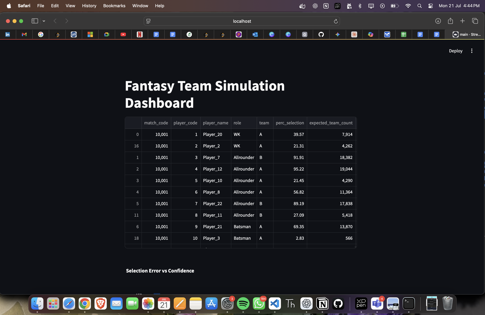
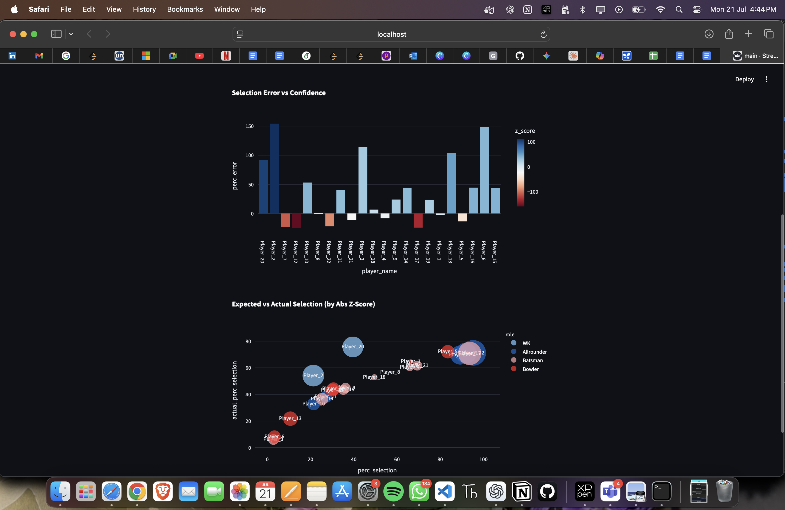

# 🏏 Fantasy Team Simulation with Accuracy Dashboard

This project simulates **20,000 unique fantasy cricket teams** using **probabilistic player selection** data. It evaluates the simulation accuracy vs expected selection rates and presents it interactively using a **Streamlit dashboard**.

---

## 🚀 Features

* ✨ Role-constrained team generation (Batsman, Bowler, WK, Allrounder)
* 📊 Player selection using weighted probabilities (`perc_selection`)
* ✅ Ensures 11-player unique teams, with at least one player per role
* 📂 Outputs:

  * `team_df.csv` — simulated teams with player data
  * `accuracy_summary.csv` — player-wise selection vs expected stats
* 🔍 Accuracy Evaluation:

  * Relative selection error
  * Z-score confidence
* 📊 Visual Dashboard:

  * Bar chart: Selection Error vs Z-score
  * Bubble chart: Expected vs Actual selection (Z-score sized)

---

## 📆 Sample Output Screenshots

### 📄 Table: Accuracy Summary



### 📊 Graphs

* Error vs Confidence
* Expected vs Actual Selection (Bubble Chart)



---

## 📂 Repository Structure

```
fantasy-team-simulator/
├── main.py                       # Full simulation + dashboard
├── player_data_sample.csv       # Input: player roles + selection %
├── outputs/
│   ├── accuracy_summary.csv     # Accuracy report
│   └── team_df.csv              # Full simulated teams
├── screenshots/
│   ├── dashboard_table.png      # UI screenshot
│   └── dashboard_graphs.png     # Visuals screenshot
├── requirements.txt             # Dependencies
└── README.md                    # Project info (this file)
```

---

## 🚜 How It Works

1. **Input**: `player_data_sample.csv` contains:

   * `player_code`, `player_name`, `role`, `perc_selection`, etc.
2. **Simulation**:

   * Randomly selects players based on `perc_selection`
   * Ensures 1+ player per role and team of 11
   * Generates 20,000 unique teams
3. **Evaluation**:

   * Compares actual appearances vs expected from `perc_selection`
   * Computes percentage error and z-score
4. **Dashboard**:

   * Interactive visualizations of errors, confidence, and outliers

---

## 📈 Accuracy Metrics

* ✅ **Players within ±5% error**
* ❌ **Players outside ±5% error**
* ↓ Minimum Error
* ↑ Maximum Error
* 🔢 **Z-score**: confidence of error deviation

---

## 🖥️ How to Run

### 1. Install Requirements

```bash
pip install -r requirements.txt
```

### 2. Run Streamlit App

```bash
streamlit run main.py
```

### 3. Outputs Generated:

* `/outputs/accuracy_summary.csv`
* `/outputs/team_df.csv`

> Dashboard will launch at: [http://localhost:8501](http://localhost:8501)

---

## 🔹 Use Case

> This simulation is useful for fantasy platforms to verify if player popularity-based selections reflect accurately in large-scale team generation and to detect anomalies.

---

## ⚖️ Tech Stack

* Python 3.9+
* Streamlit
* Pandas & NumPy
* Plotly Express

---

## 🚞️ Future Improvements

* Dynamic filters by role, z-score, error, etc.
* Upload any dataset from UI
* Real-time probability tuning
* Integration with match prediction APIs

---

## 💬 Contact

Made by Swayam Sahoo
* LinkedIn: [linkedin.com/in/swayamsahoo11](https://linkedin.com/in/swayamsahoo11)
* Portfolio: [swayamsahoo.netlify.app](https://swayamsahoo.netlify.app)
* Email: [swayampr.sahoo@email.com](mailto:swayampr.sahoo@email.com)


